# Autonomous-Driving-Perception-Pipeline

⭐ **1. Introduction**

This project builds a perception pipeline for autonomous driving that converts raw camera data into actionable scene understanding. It estimates drivable road space, detects lane boundaries, and computes distances to surrounding objects.

The system combines semantic segmentation, depth-based 3D reconstruction, and classical computer vision techniques to make the environment interpretable for safe vehicle navigation.

<table>
  <tr>
    <td align="center">
      <b></b> 
      
    </td>
  </tr>
</table>

---

🧩 **2. Challenge**

This project tackles the problem of understanding complex road scenes from noisy and imperfect vision data in autonomous driving.

Key challenges include:

- Converting 2D image + depth data into reliable 3D road understanding.  
- Handling noisy and redundant object detections from vision models.  
- Robustly estimating the ground plane despite outliers in segmentation.  
- Extracting stable lane boundaries from fragmented segmentation outputs.  
- Estimating real-world distances to objects using camera geometry and depth.

---

🎯 **3. Objectives**

- Estimate drivable space using semantic segmentation output.
- Estimate the ground plane.
- Estimate the lane boundaries using semantic segmentation output.
- Compute minimum distance to impact using 2D object detection output.

---

🛠 **4. Tech Stack**

The project combines computer vision techniques with pretrained perception outputs to build a full autonomous driving scene understanding pipeline:

- Python – core implementation of the perception pipeline  
- NumPy – numerical computations for geometry, projections, and filtering  
- OpenCV – edge detection and lane line extraction (Canny + Hough Transform)  
- Matplotlib – visualization of segmentation, lanes, and detections  
- Semantic Segmentation (Pretrained CNN Output) – pixel-wise road scene labels (road, lanes, vehicles, pedestrians)  
- 2D Object Detection (Pretrained Detector Output) – bounding boxes and confidence scores for surrounding objects  
- Depth Maps – 3D reconstruction and distance estimation  
- Camera Geometry – pinhole projection model for lifting 2D pixels into 3D space
  
---

🧩 **5. Basics**

*(A) Stereo Cameras*  

Depth maps are typically generated using stereo cameras, which mimic human binocular vision by capturing the same scene from two slightly different viewpoints. The difference between the two images allows the system to estimate how far each pixel is from the camera.

In this project, the depth map is provided directly and represents per-pixel distance information used later for 3D scene understanding and object distance estimation.

<table>
  <tr>
    <td align="center">
      <b>Stereo Cameras</b> 
      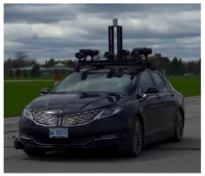
    </td>
  </tr>
</table>

*(B) Semantic Segmentation*  

Semantic segmentation provides a **pixel-wise classification of the scene**, where each pixel in the image is assigned a semantic label such as road, sidewalk, vehicle, pedestrian, or background.

In this project, the segmentation output is generated by a **pretrained convolutional neural network (CNN)** and provided as a labeled image map. The pipeline directly uses these per-pixel class labels to identify road regions, lane markings, and object areas for downstream perception tasks.

<table>
  <tr>
    <td align="center">
      <b>Pixel-wise semantic segmentation output of the driving scene</b> 
      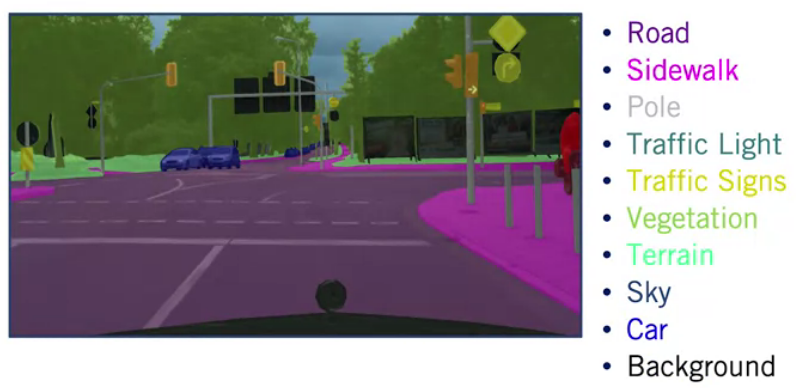
    </td>
  </tr>
</table>

*(C) Object Detection*  

Object detection identifies and localizes objects in a scene such as vehicles, pedestrians, cyclists, and traffic signs.

In this project, the detection output is provided as bounding boxes in the image along with class labels and confidence scores. Each bounding box defines a rectangular region around an object using its top-left and bottom-right coordinates, giving both the position and approximate size of the object in the image. This allows the pipeline to understand where objects are located in the scene and how much visual space they occupy.

<table>
  <tr>
    <td align="center">
      <b>2D object detection output with bounding boxes and class predictions</b> 
      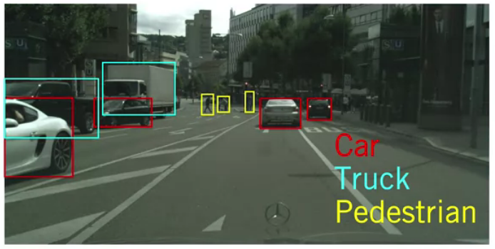
    </td>
  </tr>
</table>

---

🧠 **6. Simplified Pipeline Setup**

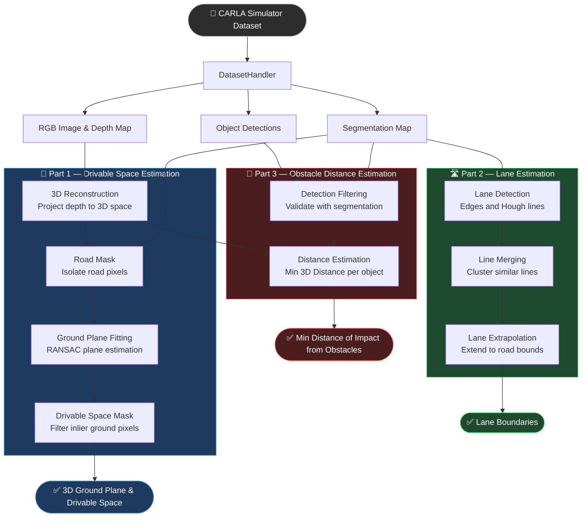
**Part 1**
  - **3D Reconstruction**: Converts depth image into a 3D point cloud (spatial map of the scene) using camera geometry.
  - **Road Mask**: Extracts road pixels from the segmentation map. These pixels are used as input for 3D road modeling.
  - **Ground Plane Fitting (RANSAC)** - Fits a flat road surface to the 3D road points from the road mask. RANSAC is a method that finds the best plane while ignoring noisy/outlier points (e.g., cars, pedestrians on the road).
  - **Drivable Space Mask** - Keeps points close to the estimated road plane, representing the physically drivable area.

**Part 2**
  - **Lane Detection**: Finds lane markings by detecting edges and line segments in segmentation output.
  - **Line Merging**: Groups and combines small, similar line segments into one clean lane line.
  - **Lane Extrapolation** → Extends lane lines across the road and picks the lane where the car is currently driving.

**Part 3**
  - **Detection Filtering**: Removes incorrect object detections using segmentation consistency (keeps only likely real objects).
  - **Distance Estimation**: Computes real-world distance by converting pixels inside each bounding box into 3D points and taking the closest one.

---

📈 **7. Results**

**Part 1: Drivable Space Estimation**

<table>
  <tr>
    <td align="center">
      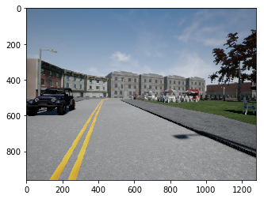
      
<b>Input image for perception</b>

    </td>
    <td align="center">
      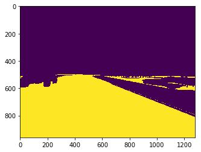
      
<b>Identified Drivable Region — Pixel View</b>

    </td>
  </tr>
</table>

**Part 2: Lane Estimation**

<table>
  <tr>
    <td align="center">
      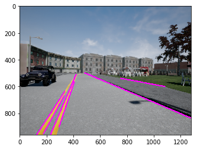
      
<b>Lane Boundary Proposals</b>

    </td>
    <td align="center">
      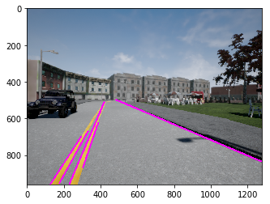
      
<b>Filtered Lane Lines</b>

    </td>
    <td align="center">
      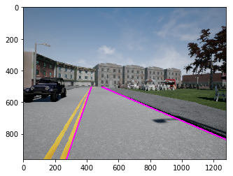
      
<b>Current Lane Identification</b>

    </td>
  </tr>
</table>

**Part 3: Obstacle Distance Estimation**

<table>
  <tr>
    <td align="center">
      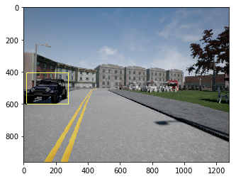
      
<b>Filtered Object(s)</b>

    </td>
    <td align="center">
      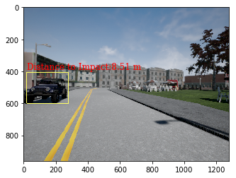
      
<b>Minimum Impact Distance</b>

    </td>
  </tr>
</table>

---

📈 **8. End-to-End Pipeline Test Case**

This section demonstrates the performance of the full perception pipeline on an unseen test frame. The system processes raw sensor inputs to estimate drivable space, detect lane boundaries, and compute distances to surrounding objects.

The results highlight the robustness of the geometric and vision-based methods under realistic and noisy scene conditions.

<table>
  <tr>
    <td align="center">
      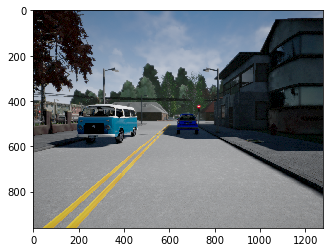
      
<b>Input Scenario</b>

    </td>
    <td align="center">
      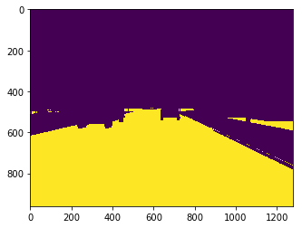
      
<b>Identified Drivable Region</b>

    </td>
  </tr>

  <tr>
    <td align="center">
      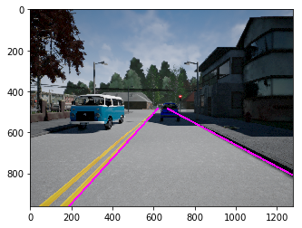
      
<b>Lane Identification</b>

    </td>
    <td align="center">
      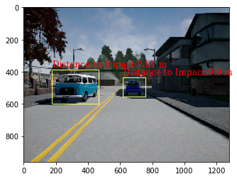
      
<b>Distance to Impact</b>

    </td>
  </tr>
</table>

---

🧭 **9. Future Extensions**

Potential improvements to further enhance the robustness and scalability of the perception pipeline include:

- Extending evaluation to diverse driving scenes (urban, highway, adverse weather) to test generalization. 
- Explore the possibility of replacing rule-based lane detection with a learning-based lane segmentation model for improved robustness.

---

⚠️ **10. Data Note**

This project was developed as part of a self-driving car perception assignment using simulated data from the CARLA environment. All inputs used in this pipeline (semantic segmentation, depth maps, and 2D object detections) are pre-generated and provided as part of the dataset. 

The focus of this work is on perception logic, geometric reasoning, and classical computer vision techniques for scene understanding.

---

👨‍💻 **11. Skills Demonstrated**

This project demonstrates an end-to-end autonomous driving perception pipeline that transforms raw sensor inputs into structured scene understanding.

I demonstrate my ability to work with:

- Camera-based 3D geometry and point cloud reconstruction 
- Use semantic segmentation outputs for scene understanding
- RANSAC-based ground plane estimation for drivable space detection    
- Rule-based lane detection using classical computer vision (Canny + Hough Transform)  
- Object detection filtering using segmentation consistency  
- 3D distance estimation for obstacle proximity analysis  

---

